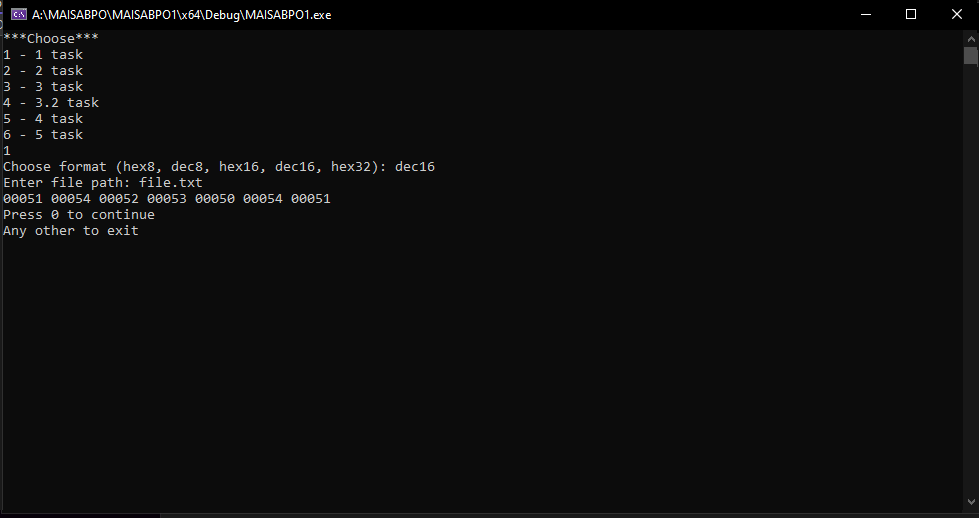
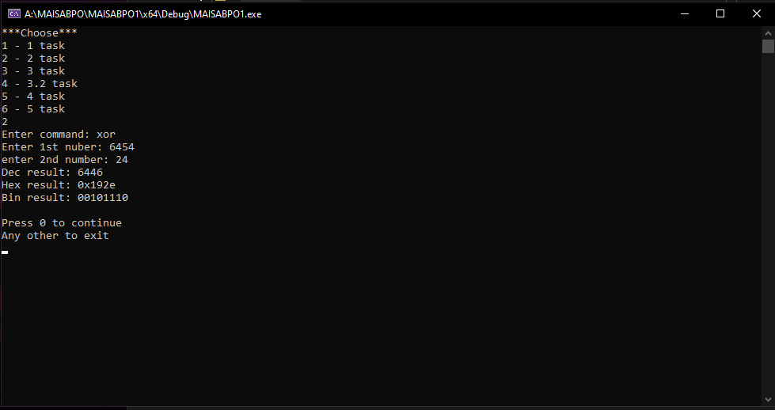
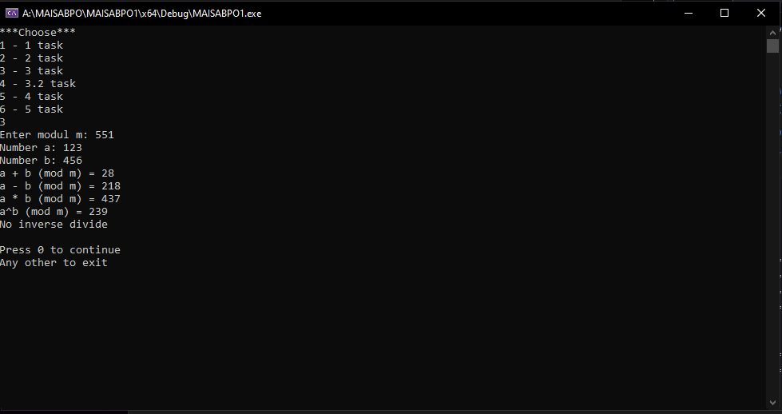
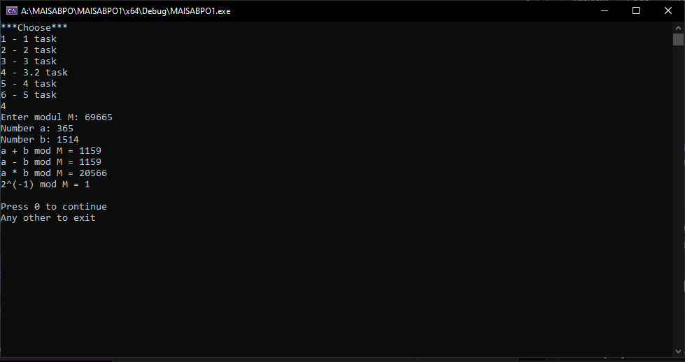
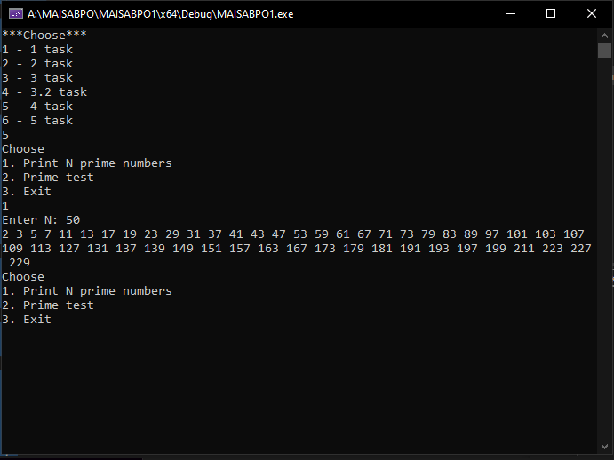
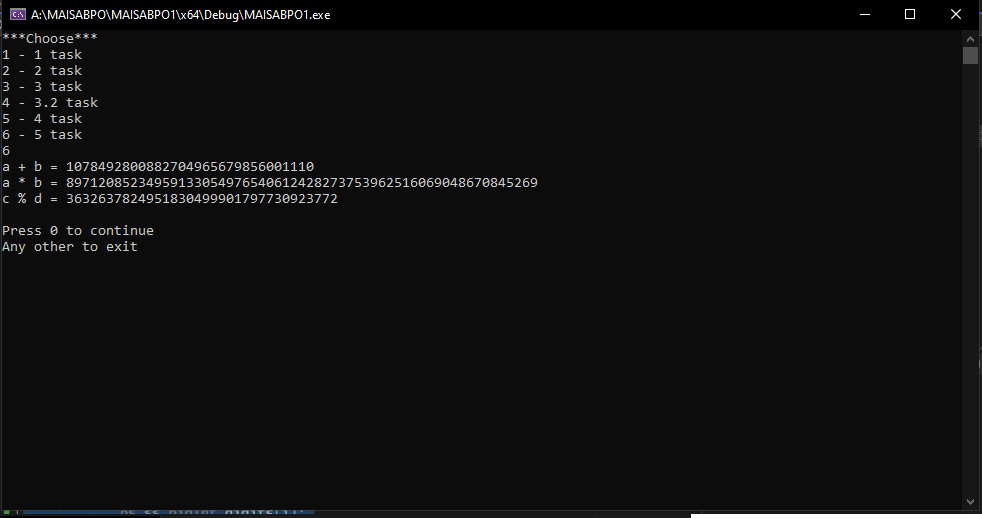

# Лабораторная работа № 1. Основной математический аппарат
#### *Выполнил студент группы БИ-41 Семенов Алексей*
## 1. Бинарное представление данных.
```
void printFile(const std::string& format, const std::string& filePath) {
    std::ifstream file(filePath, std::ios::binary);

    if (!file) {
        std::cerr << "Cann't open file: " << filePath << std::endl;
        return;
    }

    unsigned char byte;
    while (file.read(reinterpret_cast<char*>(&byte), sizeof(byte))) {
        if (format == "hex8") {
            std::cout << std::hex << std::setw(2) << std::setfill('0') << static_cast<int>(byte) << " ";
        }
        else if (format == "dec8") {
            std::cout << std::dec << std::setw(3) << std::setfill('0') << static_cast<int>(byte) << " ";
        }
        else if (format == "hex16") {
            std::cout << std::hex << std::setw(4) << std::setfill('0') << static_cast<int>(byte) << " ";
        }
        else if (format == "dec16") {
            std::cout << std::dec << std::setw(5) << std::setfill('0') << static_cast<int>(byte) << " ";
        }
        else if (format == "hex32") {
            std::cout << std::hex << std::setw(8) << std::setfill('0') << static_cast<int>(byte) << " ";
        }
        else {
            std::cerr << "Unknown format: " << format << std::endl;
            return;
        }
    }

    file.close();
}
```

## 2. Битовые операции.
```
void taskTwo(const std::string& command, int num1, int num2) {
    int result = 0;

    if (command == "xor") {
        result = num1 ^ num2;
    }
    else if (command == "and") {
        result = num1 & num2;
    }
    else if (command == "or") {
        result = num1 | num2;
    }
    else if (command == "set1") {
        result = num2 | (1 << num1);
    }
    else if (command == "set0") {
        result = num2 & ~(1 << num1);
    }
    else if (command == "shl") {
        result = num2 << num1;
    }
    else if (command == "shr") {
        result = num2 >> num1;
    }
    else if (command == "rol") {
        result = (num2 << num1) | (num2 >> (8 - num1));
    }
    else if (command == "ror") {
        result = (num2 >> num1) | (num2 << (8 - num1));
    }
    else if (command == "mix") {
        if (num1 >= 0 && num1 < 8) {
            int mask = 1 << num1;
            result = 0;
            for (int i = 0; i < 8; i++) {
                if (num2 & (1 << i)) {
                    result |= mask;
                }
                mask <<= 1;
            }
        }
        else {
            std::cerr << "Wrong order for mix command (u can use from 0 to 7)." << std::endl;
            return;
        }
    }
    else {
        std::cerr << "Unknown command: " << command << std::endl;
        return;
    }

    std::cout << "Dec result: " << result << std::endl;
    std::cout << "Hex result: 0x" << std::hex << result << std::endl;
    std::cout << "Bin result: ";
    for (int i = 7; i >= 0; i--) {
        std::cout << ((result >> i) & 1);
    }
    std::cout << std::endl;
}
```

## 3. Модульная арифметика.
```
int gcd(int a, int b) {
    if (b == 0) {
        return a;
    }
    return gcd(b, a % b);
}

int modInverse(int a, int m) {
    a = a % m;
    for (int x = 1; x < m; x++) {
        if ((a * x) % m == 1) {
            return x;
        }
    }
    return -1;
}

int addMod(int a, int b, int m) {
    return (a + b) % m;
}

int subtractMod(int a, int b, int m) {
    return (a - b + m) % m;
}

int multiplyMod(int a, int b, int m) {
    return (a * b) % m;
}

int powerMod(int base, int exponent, int m) {
    int result = 1;
    while (exponent > 0) {
        if (exponent % 2 == 1) {
            result = (result * base) % m;
        }
        base = (base * base) % m;
        exponent /= 2;
    }
    return result;
}

int divideMod(int a, int b, int m) {
    int inverse = modInverse(b, m);
    if (inverse == -1) {
        std::cerr << "No inverse divide" << std::endl;
        return -1;
    }
    return (a * inverse) % m;
}
```

## 3.2 Модульная арифметика на полиномах GF(2,n).
```
uint32_t PolynomialDegree(uint32_t num) {
    uint32_t degree = 0;
    while (num >>= 1) {
        degree++;
    }
    return degree;
}

uint32_t GF2nAdd(uint32_t a, uint32_t b) {
    return a ^ b;
}

uint32_t GF2nSubtract(uint32_t a, uint32_t b) {
    return a ^ b;
}

uint32_t GF2nMultiply(uint32_t a, uint32_t b, uint32_t m) {
    uint32_t result = 0;
    while (b > 0) {
        if (b & 1) {
            result ^= a;
        }
        b >>= 1;
        a <<= 1;
        if (PolynomialDegree(a) >= PolynomialDegree(m)) {
            a ^= m;
        }
    }
    return result;
}

uint32_t GF2nInverse(uint32_t a, uint32_t m) {
    uint32_t x = 1;
    uint32_t y = 0;
    uint32_t b = m;

    while (a != 0) {
        uint32_t q = b / a;
        uint32_t t = a;
        a = b % a;
        b = t;

        t = x;
        x = y;
        y = t ^ GF2nMultiply(q, y, m);
    }

    if (b == 1) {
        if (x < 0) {
            x += m;
        }
        return x;
    }
    else {
        return 0;
    }
}
```

## 4. Проверка числа на простоту.
```
void printPrimes(int N) {
    if (N <= 0) {
        return;
    }

    std::vector<bool> isPrime(N * 11, true); 
    isPrime[0] = isPrime[1] = false;     

    for (int p = 2; p * p < N * 11; p++) {
        if (isPrime[p]) {
            for (int i = p * p; i < N * 11; i += p) {
                isPrime[i] = false; 
            }
        }
    }

    int count = 0;
    for (int num = 2; count < N; num++) {
        if (isPrime[num]) {
            std::cout << num << " ";
            count++;
        }
    }
    std::cout << std::endl;
}

bool isPrime(int num) {
    if (num <= 1) {
        return false; 
    }

    if (num <= 3) {
        return true; 
    }

    if (num % 2 == 0 || num % 3 == 0) {
        return false;
    }

    for (int i = 5; i * i <= num; i += 6) {
        if (num % i == 0 || num % (i + 2) == 0) {
            return false;
        }
    }

    return true;
}
```

## 5. Арифметика больших чисел.
```
class BigInteger {
private:
    std::vector<int> digits;

public:
    BigInteger() {}

    BigInteger(const std::string& numStr) {
        for (int i = numStr.length() - 1; i >= 0; i--) {
            digits.push_back(numStr[i] - '0');
        }
    }

    void add(const BigInteger& other) {
        int carry = 0;
        int max_len = std::max(digits.size(), other.digits.size());

        for (int i = 0; i < max_len || carry; i++) {
            if (i == digits.size()) {
                digits.push_back(0);
            }
            digits[i] += carry + (i < other.digits.size() ? other.digits[i] : 0);
            carry = digits[i] / 10;
            digits[i] %= 10;
        }
    }

    void multiply(const BigInteger& other) {
        std::vector<int> result(digits.size() + other.digits.size(), 0);

        for (int i = 0; i < digits.size(); i++) {
            for (int j = 0, carry = 0; j < other.digits.size() || carry; j++) {
                long long cur = result[i + j] +
                    digits[i] * 1ll * (j < other.digits.size() ? other.digits[j] : 0) + carry;
                result[i + j] = cur % 10;
                carry = cur / 10;
            }
        }

        while (result.size() > 1 && result.back() == 0) {
            result.pop_back();
        }

        digits = result;
    }

    void modulo(const BigInteger& other) {
        BigInteger quotient;
        BigInteger dividend = *this;

        while (dividend >= other) {
            BigInteger temp = other;
            int factor = 1;

            while (dividend >= (temp * 10)) {
                temp.multiply(BigInteger("10"));
                factor *= 10;
            }

            while (dividend >= temp) {
                dividend -= temp;
                quotient.add(BigInteger(std::to_string(factor)));
            }
        }

        *this = dividend;
    }

    bool operator>=(const BigInteger& other) const {
        if (digits.size() != other.digits.size()) {
            return digits.size() > other.digits.size();
        }
        for (int i = digits.size() - 1; i >= 0; i--) {
            if (digits[i] != other.digits[i]) {
                return digits[i] > other.digits[i];
            }
        }
        return true;
    }

    bool operator<(const BigInteger& other) const {
        return !(*this >= other);
    }

    BigInteger operator*(const BigInteger& other) const {
        BigInteger result;
        result.digits.assign(digits.size() + other.digits.size(), 0);

        for (int i = 0; i < digits.size(); i++) {
            int carry = 0;
            for (int j = 0; j < other.digits.size() || carry; j++) {
                long long cur = result.digits[i + j] +
                    digits[i] * 1ll * (j < other.digits.size() ? other.digits[j] : 0) + carry;
                result.digits[i + j] = cur % 10;
                carry = cur / 10;
            }
        }

        while (result.digits.size() > 1 && result.digits.back() == 0) {
            result.digits.pop_back();
        }

        return result;
    }

    bool operator==(const BigInteger& other) const {
        return digits == other.digits;
    }

    bool operator!=(const BigInteger& other) const {
        return !(*this == other);
    }

    BigInteger operator+(const BigInteger& other) const {
        BigInteger result(*this);
        result.add(other);
        return result;
    }

    BigInteger operator-(const BigInteger& other) const {
        BigInteger result(*this);
        result -= other;
        return result;
    }

    BigInteger& operator+=(const BigInteger& other) {
        this->add(other);
        return *this;
    }

    BigInteger& operator-=(const BigInteger& other) {
        if (*this < other) {
            digits = { 0 };
            return *this;
        }

        int borrow = 0;
        for (size_t i = 0; i < digits.size(); ++i) {
            int sub = digits[i] - borrow;
            if (i < other.digits.size()) {
                sub -= other.digits[i];
            }
            if (sub < 0) {
                sub += 10;
                borrow = 1;
            }
            else {
                borrow = 0;
            }
            digits[i] = sub;
        }

        while (digits.size() > 1 && digits.back() == 0) {
            digits.pop_back();
        }

        return *this;
    }

    BigInteger operator*(int num) const {
        BigInteger result(*this);

        for (int i = 0, carry = 0; i < result.digits.size() || carry; i++) {
            if (i == result.digits.size()) {
                result.digits.push_back(0);
            }
            long long cur = result.digits[i] * 1ll * num + carry;
            result.digits[i] = cur % 10;
            carry = cur / 10;
        }

        while (result.digits.size() > 1 && result.digits.back() == 0) {
            result.digits.pop_back();
        }

        return result;
    }

    friend std::ostream& operator<<(std::ostream& os, const BigInteger& bigInt) {
        for (int i = bigInt.digits.size() - 1; i >= 0; i--) {
            os << bigInt.digits[i];
        }
        return os;
    }
};
```

